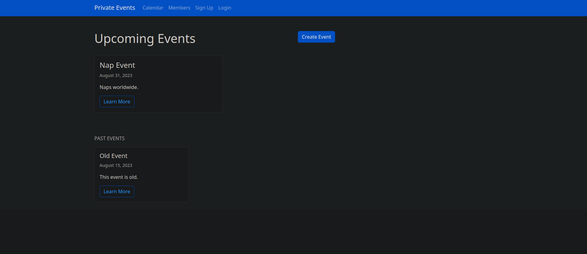
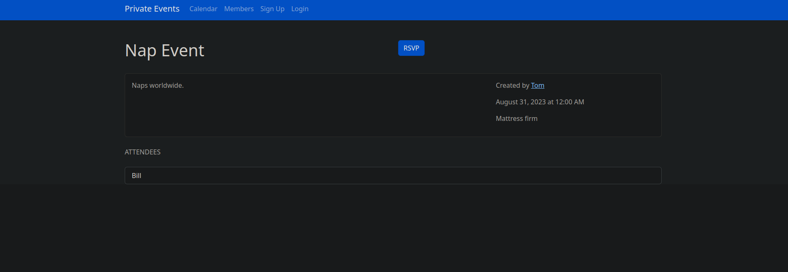
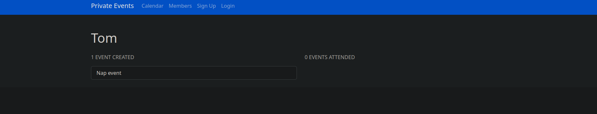

# Private-Events

## Live Project

You can try it out [here](https://ramsey-events-dcc31c2a7424.herokuapp.com/) via Heroku.
Email: test@email.com
Password: password

## Screenshots

  
  
  

## About

Private-events was created based on The Odin Project's advanced forms project for building a [private-event](https://www.theodinproject.com/lessons/ruby-on-rails-private-events) site like Eventbrite. This project is fairly simple. A user can create events, attend many events. An event can be attended by many users. Events take place at a specific date, time, and location. 

The main focus was Active Record and more complex associations. In addition, I learned how to use scopes and foreign keys. I also dabbled in Bootstrap for this project, but found vanilla CSS more enjoyable. Overall, it was good experience with complexity.

## Features 

- Log in / Log out

  - utilized [Devise](https://github.com/heartcombo/devise) for user authentication

- User profile

  - shows events user has created and events they have attended
 
- Homepage

  - displays all upcoming and past events

- Create event 

  - user must be logged in to create an event. Events have title, description, creator, date, time, and location. On the event page, attendees/rsvps are shown as well.

- Event page 

  - full event details for non-creator. Ability to edit or delete event by creator.

- Styling

  - Bootstrap for CSS 
